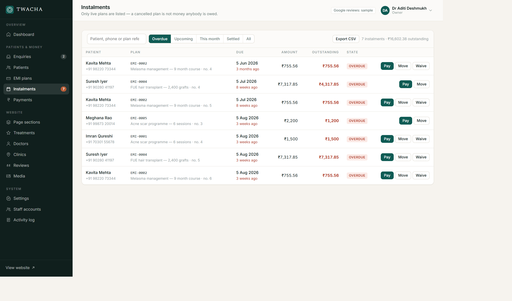
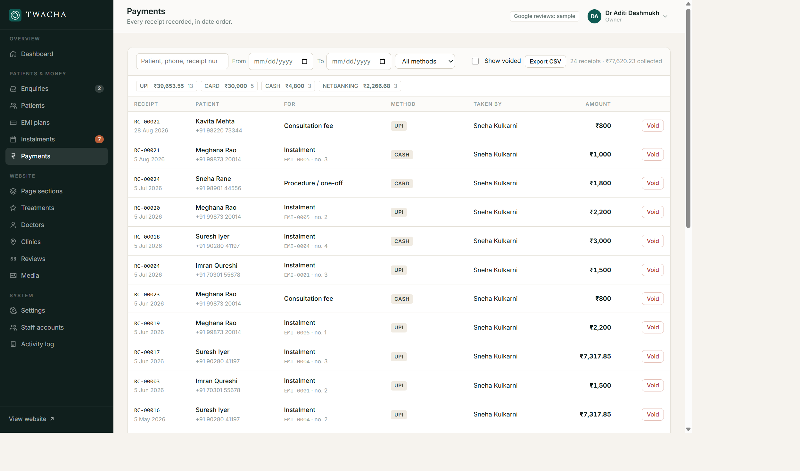

# TWACHA — dermatology clinic site with an admin panel

A public website for a skin clinic, plus an admin panel the clinic actually runs
on: website content, enquiries from the booking form, patient records, EMI plans
and the receipts against them.

Reviews and clinic photographs come from Google Maps when an API key is
configured. Everything else is stored locally in SQLite and edited through the
admin panel — no code change is needed to alter a heading, a price, a doctor's
biography or the order of a section.

- **Public site** — `http://localhost:5173/`
- **Admin panel** — `http://localhost:5173/admin/`


## Running it

Node **22.5 or newer** is required. The database driver is `node:sqlite`, which
ships with Node itself, so there is nothing to compile and no native module to
go wrong on a new machine.

```bash
npm install
npm run seed     # creates data/app.db and fills it with demo content
npm start        # http://localhost:5173
```

`npm run dev` does the same with `--watch`, restarting when a server file
changes. The front end has no build step: the browser loads the same files that
are on disk, so a CSS or JS edit needs only a reload.

### Signing in

`npm run seed` creates three accounts so the role differences are visible:

| Email | Password | Role |
|---|---|---|
| `owner@twacha.in` | `TwachaAdmin2026` | owner |
| `manager@twacha.in` | `ClinicManager2026` | manager |
| `reception@twacha.in` | `FrontDesk2026` | staff |

What each role may actually do, enforced on the server and reflected in the
panel rather than only hinted at:

| | owner | manager | staff |
|---|---|---|---|
| Enquiries, patients, record receipts | yes | yes | yes |
| Create EMI plans | yes | yes | yes |
| Void a receipt, waive an instalment | yes | yes | **no** |
| Website content and settings | yes | yes | read only |
| Staff accounts and password resets | yes | **no** | **no** |

**Change these before the machine is reachable by anybody else.** Either edit
them under Staff accounts, or set `SEED_ADMIN_EMAIL` and `SEED_ADMIN_PASSWORD`
in `.env` before the first seed.

`npm run reseed` wipes and rebuilds the demo data. It is destructive and asks
for `--force` precisely so it cannot be run by accident.

### Checking it still works

With the server running, `npm run smoke` reads every endpoint, checks the public
payload has content in each section, and asserts the permission rules — that a
write without a CSRF token is refused, that reception cannot edit the website or
read staff accounts, that a manager cannot create accounts. It exits non-zero on
any failure, so it is usable from CI.

## Connecting Google reviews and photographs

Without a key the site shows sample reviews. They are stored with
`source = 'google-seed'`, the admin panel labels them as samples on every screen
that touches them, and the dashboard says so too — so nobody mistakes seeded
content for real patient feedback.

To go live:

1. Create a Google Cloud project.
2. Enable **Places API (New)**.
3. Create an API key and restrict it to that one API.
4. Put it in `.env` as `GOOGLE_MAPS_API_KEY=…` and restart.
5. In the admin panel, **Settings → Find a Place ID**, search for the clinic the
   way a patient would, then save the returned ID against the clinic under
   **Clinics**.
6. **Settings → Sync reviews now**.

Three things are worth knowing before you promise anything to a client:

- **Google returns at most five reviews per place**, and does not allow
  reordering or filtering them. Anything beyond five has to be a review the
  clinic publishes itself, which is why the Reviews screen lets you write and
  order your own alongside the Google ones.
- **Photographs are proxied**, not hot-linked. The browser requests
  `/api/photo/:name` and the server fetches from Google, so the API key never
  reaches the page source. If your network intercepts TLS, Node needs
  `NODE_EXTRA_CA_CERTS` pointing at your corporate CA bundle or the fetch will
  fail and the site will fall back to a placeholder.
- **Responses are cached** for `GOOGLE_CACHE_MINUTES` (six hours by default),
  because Google bills per request and reviews do not change minute to minute.

## What the admin panel covers

**Website** — page sections and the items inside them, treatments and their
categories, doctors, clinics, reviews, and a media library. Sections can be
reordered by dragging, and published or hidden individually. Every save clears
the public site's cache, so a change is live on the next page load.

**Patients & money**

- *Enquiries* — everything the booking form produces, with status, priority,
  assignee and an internal note trail. One click converts an enquiry to a
  patient; if the phone number already exists it links to that patient instead
  of creating a duplicate.
- *Patients* — the register, and a per-patient file showing plans, receipts,
  outstanding balance and enquiry history.
- *EMI plans* — schedule generation with a live preview before anything is
  written, no-cost and interest-bearing, with a full amortisation table.
- *Instalments* — the collections worklist: overdue, upcoming, this month,
  settled. Record a payment, move a due date, or waive an instalment from the
  row.
- *Payments* — a day-book of every receipt with method totals, searchable by
  receipt number, and a CSV export.

**System** — clinic settings, the Google connection, staff accounts, and a
read-only activity log.



The instalments worklist above is where the day's chasing happens: arrears
first, oldest at the top, with the amount still owed separated from the amount
originally due so a part payment is obvious. Waive is deliberately absent on
rows that have already been part paid.



### On the money side

Every amount is an **integer number of paise**. There is not one floating-point
number in the schema, because a rupee figure that has been through a float is no
longer a figure you can put on a receipt. Rounding remainders are absorbed into
the final instalment, so a schedule always sums exactly to the amount financed:
₹1,00,000 over six months is five instalments of ₹16,666.67 and a last one of
₹16,666.65.

A receipt is never deleted, only **voided** — with a reason, which is kept. The
receipt number stays spent, and if the receipt was allocated to an instalment
that instalment reopens. That is the difference between a correction and a
cover-up.

Due dates clamp to the end of short months: a plan starting 31 January falls due
28 February, then 31 March.

"Today" is evaluated in the clinic's timezone (`CLINIC_TZ`, default
`Asia/Kolkata`), not the server's, because whether a payment is late is a
question about the clinic's day.

**This is a record-keeping system, not a payment gateway.** Nothing here moves
money or talks to a bank. Somebody records what was received. If you need real
collection, that is a separate integration and a regulated one.

## Configuration

Copy `.env.example` to `.env`. Every value has a working default; the file
documents what each one changes. The variables that matter most in production
are `GOOGLE_MAPS_API_KEY`, `COOKIE_SECURE=1` when served over HTTPS, and
`TRUST_PROXY=1` only when behind a reverse proxy you control.

## Layout

```
server/
  index.js            Express wiring, static files, error handling
  db.js               Schema (19 tables) and query helpers
  seed.js             Demo data — a plausible Pune dermatology clinic
  lib/
    auth.js           scrypt hashing, DB-backed sessions, CSRF
    money.js          Paise arithmetic, amortisation, clinic-local dates
    google.js         Places API client, TTL cache, photo proxy
    validate.js       Field validation that returns readable messages
    http.js           Error classes, cookies, rate limiting
    activity.js       Audit log
  routes/
    public.js         The site's own API, plus enquiry submission
    auth.js           Sign in and out
    admin-content.js  Content CRUD, media, settings, Google, accounts
    admin-crm.js      Enquiries, patients, plans, instalments, payments
public/               The website. index.html + one CSS file + one JS module
admin/                The admin panel. Same idea, one module per screen
scripts/smoke.mjs     Endpoint and permission checks — `npm run smoke`
data/                 app.db, uploads, Google cache. Not in version control
```

## Security

Passwords are hashed with scrypt. Sessions live in the database with random
tokens, httpOnly `SameSite=Strict` cookies, and a CSRF token required on every
write. Login is rate limited per IP, and every write is attributed in the
activity log.

Two things are deliberately left to the deployment: TLS, and putting the admin
panel behind something before exposing it to the internet. `COOKIE_SECURE=1`
assumes you have done the first.

## Known limits

- Google's five-review ceiling, described above.
- Uploads go to `data/uploads/` on local disk. Fine for one server; a second one
  would need shared storage.
- The public site's cache is in-process, so several server processes would each
  hold their own copy for up to its lifetime.
- No email or SMS. An enquiry appears in the panel and the clinic telephones
  back; nothing is sent automatically.
- Demo photographs are hot-linked from Unsplash placeholders. Replace them
  through the media library before showing this to a client as their own site.
